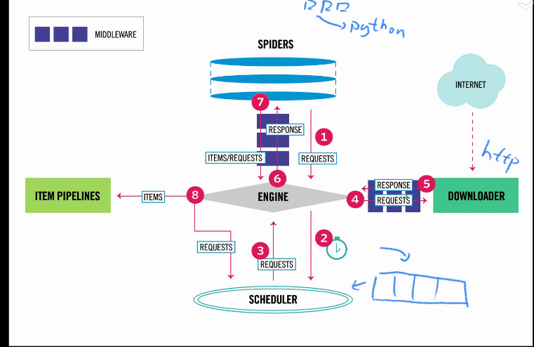

# scrapy 爬虫框架 学习笔记
## 一 安装
`pip install scrapy`
#### 安装需要的依赖可以在  
[https://www.lfd.uci.edu/~gohlke/pythonlibs/#lxml](https://www.lfd.uci.edu/~gohlke/pythonlibs/#lxml)这个网站下载!!!

## 二 创建项目
`scrapy startproject {项目名}` 
eg:`scrapy startproject tutorial` 
#### 该命令将会创建包含下列内容的 tutorial 目录
```
tutorial/
    scrapy.cfg
    tutorial/
        __init__.py
        items.py
        pipelines.py
        settings.py
        spiders/
            __init__.py
            ...
```
   + scrapy.cfg: 项目的配置文件
   + tutorial/: 该项目的python模块。之后您将在此加入代码。
   + tutorial/items.py: 项目中的item文件.
   + tutorial/pipelines.py: 项目中的pipelines文件.
   + tutorial/settings.py: 项目的设置文件.
   + tutorial/spiders/: 放置spider代码的目录.

## 三 scrapy 的工作原理


## 四 scraopy调试工具
`scrapy shell`
#### scrapy 常用命令行 命令
```
    fetch（url）
    responnse.url	.teext	.status   .css()
    view(response) 在浏览器查看页面
```
## 五 实现 spider
   + 继承scrapy.Spider创建Spider类
   + 通过name属性为Spider命名
   + 通过start_urls设置起始爬取点
   + 实现页面解析函数parse

## 六 运行爬虫
`scrapy crawl {name}`

## Request构造器函数签名
```
Request(url, callback=None, method='GET', headers=None, body=None,
                 cookies=None, meta=None, encoding='utf-8', priority=0,
                 dont_filter=False, errback=None, flags=None)
```
   + url(必填) 请求页面的url地址
   + callback 页面的解析函数,Callable类型,Request对象请求的页面下载完成后，由该参数指定的页面解析函数被调用,如果未传递该参数,默认调用Spider的parse方法。
   + method http请求的方法 默认 GET
   + headers http请求的头部字典，dict类型.{'Accept':'text/html',}如果其中某项值未None,则表示不发送该项http头部,{'Cookie':None},禁止发送cookie
   + body (str or unicode) – the request body. If a unicode is passed, then it’s encoded to str using the encoding passed (which defaults to utf-8). If body is not given,, an empty string is stored. Regardless of the type of this argument, the final value stored will be a str (never unicode or None).
   + cookies (dict or list) –
        the request cookies. These can be sent in two forms.
        ```
            request_with_cookies = Request(url="http://www.example.com",
                                cookies={'currency': 'USD', 'country': 'UY'})

            request_with_cookies = Request(url="http://www.example.com",
                                cookies=[{'name': 'currency',
                                            'value': 'USD',
                                            'domain': 'example.com',
                                            'path': '/currency'}])
        ```
    + encoding (string) – the encoding of this request (defaults to 'utf-8'). This encoding will be used to percent-encode the URL and to convert the body to str (if given as unicode).
    + priority (int) – the priority of this request (defaults to 0). The priority is used by the scheduler to define the order used to process requests. Requests with a higher priority value will execute earlier. Negative values are allowed in order to indicate relatively low-priority.
    + dont_filter (boolean) – indicates that this request should not be filtered by the scheduler. This is used when you want to perform an identical request multiple times, to ignore the duplicates filter. Use it with care, or you will get into crawling loops. Default to False.
    + errback (callable) – a function that will be called if any exception was raised while processing the request. This includes pages that failed with 404 HTTP errors and such. It receives a Twisted Failure instance as first parameter.
## Response对象
   + url (string) – the URL of this response
   + headers (dict) – the headers of this response. The dict values can be strings (for single valued headers) or lists (for multi-valued headers).
   + status (integer) – the HTTP status of the response. Defaults to 200.
   + body (str) – the response body. It must be str, not unicode, unless you’re using a encoding-aware Response subclass, such as TextResponse.
   + meta (dict) – the initial values for the Response.meta attribute. If given, the dict will be shallow copied.
   + flags (list) – is a list containing the initial values for the Response.flags attribute. If given, the list will be shallow copied.
   
   + request 产生该响应的Request对象
   + meta Response.request.meta,构造request，将额外的信息传入meta,处理时,通过meta取出!
   + selector Selector对象
   + xpath(query) 利用xpath在Response中提取数据
   + css(query) 利用css在Response中提取数据

   + urljoin(url) 生产一个绝对url地址

## Selector对象
## xpath 语法
## css选择器语法
## 封装数据
   #### 使用Item
   ```
        class DouyinItem(scrapy.Item):
            # define the fields for your item here like:
            name = scrapy.Field()
   ```
   #### Item Pipeline的功能
   + 清洗数据
   + 验证数据的有效性
   + 过滤掉重复的数据
   + 将数据存入数据库
   #### 实现 Item Pipeline
   ```
        class DouyinPipeline(object):
            def process_item(self, item, spider):
                # 处理数据
                return item
                # 抛弃数据
                raise scrapy.exceptions.DropItem()

            @classmethod
            def from_crawier(cls,crawler):
                # 创建Item Pipeline对象时，回调该类方法，通常，在该方法中通过crawler.settings读取配置
                return cls()
            
            def open_spider(self,spider)
                #开始初始化 通常数据库链接
            
            def close_spier(self,spider)
                # 关闭时,同城关闭链接
   ```
   #### 启用 Item Pipeline
   settings.py文件的 <br>
   ITEM_PIPLINES={

   }
## scrapy 支持导出的文件格式
+ json
+ csv
+ xml
+ excel(自实现)
```
    from scrapy.exporters import BaseItemExporter
    import xlwt #需要自己安装
    class ExcelItemExporter(BaseItemExporter):
            def __init__(self,file,**kwargs):
                self._configure(kwargs)
                self.file = file
                self.wbook = xlwt.Workbook()
                self.wsheet = self.wbook.add_sheet("scrapy")
                self.row = 0
            def export_item(self, item):
                fields = self._get_serialized_fields(item)
                for col,v in enumerate(x for _,x in fields):
                    self.wsheet.write(self.row,col,v)
                self.row += 1
            def finish_exporting(self):
                self.wbook.save(self.file)
```
## 利用 scrapy-redis 分布式爬取


